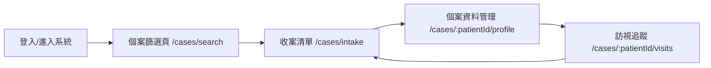

## 目標

- **技術選擇**: 採用 **Vue 3 + Vite** 作為前端框架，純前端 SPA，方便快速迭代 POC；FHIR 後端先連接 **公開 HAPI FHIR Server** 作為資料來源。
- **功能範圍**: 完成「個案篩選、收案清單、個案資料管理、訪視追蹤」的基本頁面與操作流程，資料結構對應到 FHIR Resource（如 `Patient`, `Encounter`, `Observation`, `CarePlan`, `Task` 等）。

## 架構設計

- **前端專案結構**（Vue 3 + Vite）
  - `src/main.ts`: 入口檔，掛載 `App.vue`，註冊 Router、全域樣式。
  - `src/router/index.ts`: 定義主要路由：
    - `/cases/search` 個案篩選
    - `/cases/intake` 收案清單
    - `/cases/:patientId/profile` 個案資料管理
    - `/cases/:patientId/visits` 訪視追蹤
  - `src/views/CaseSearchView.vue`: 個案篩選頁。
  - `src/views/CaseIntakeListView.vue`: 收案清單頁。
  - `src/views/CaseProfileView.vue`: 個案資料管理頁。
  - `src/views/CaseVisitsView.vue`: 訪視追蹤頁。
  - `src/components/CaseSearchForm.vue`, `CaseTable.vue`, `VisitTimeline.vue` 等可重用 UI 元件。
  - `src/api/fhirClient.ts`: 封裝呼叫 HAPI FHIR Server 的邏輯（Base URL、常用查詢、錯誤處理）。
  - `src/types/fhir.ts`: 放 FHIR Resource 的 TypeScript 型別（可只定義目前會用到的欄位）。
- **資料流與狀態管理**
  - 先使用 **Composition API + composables**（例如 `useCaseSearch`, `useCaseDetail`）管理狀態與呼叫 FHIR API，不一定一開始就導入 Vuex/Pinia。
  - 搜尋與篩選條件保存在對應的 view/composable 內，必要時透過 `query string` 保留下來（例如 `/cases/search?name=...&birthdate=...`）。
- **FHIR 對應設計（概念層級）**
  - **個案（Case）** 對應 `Patient` 主體，必要時可加上 `CarePlan` 或 `EpisodeOfCare` 作為「收案」/「方案」的容器。
  - **收案清單**：對應某篩選條件下的 `Patient` 清單，或 `CarePlan` 上標記特定 program（例如 `CarePlan.category`）。
  - **個案資料管理**：
    - 基本資料：`Patient` demographics（姓名、性別、生日、識別碼等）。
    - 臨床相關資料（可簡化）：例如最近一次 `Encounter`、關鍵 `Observation`（如 HbA1c, BP）。
  - **訪視追蹤**：
    - 訪視紀錄可先對應 `Encounter` 或 `Task`（home visit、phone call 等），以 `patient` reference 做串接。
    - 前端以時間軸或表格方式呈現，支援新增/編輯/標記完成（若公開 HAPI 只讀，就先做「假寫入」路徑或本機暫存）。
- **畫面導覽流程（簡化）**

## 功能分解

- **個案篩選（Case Search）**
  - UI: 簡易搜尋表單（姓名、病歷號/ID、出生年月日、性別等）。
  - 後端呼叫：
    - 使用 `GET [FHIR_BASE]/Patient` 搭配 `_name`, `identifier`, `birthdate`, `gender` 等查詢參數。
    - 將結果顯示為清單表格（姓名、ID、性別、年齡、最近更新時間等）。
  - 互動：點擊某一列可以「加入收案清單」或直接進入個案資料。
- **收案清單（Intake List）**
  - POC 階段可先做兩種策略擇一：
    - **策略 A（偏真實）**：以 `CarePlan` 或 `EpisodeOfCare` 上的某個標記（例如某 program 的 `category` 或 `status`）來定義「已收案」個案，列表就是針對該標記查詢。
    - **策略 B（偏雛型 demo）**：在前端記錄一份「收案清單」資料（local storage 或簡易 mock backend），用 `Patient.id` 作為 key，未連動真實 FHIR 更新。
  - 列表欄位：個案姓名、主要診斷/方案標籤（如果有）、負責個管師、狀態（active / completed）。
- **個案資料管理（Case Profile）**
  - 主畫面區塊：
    - 左：基本資料卡片（`Patient`）。
    - 右：重要臨床資訊摘要（例如最近一次 `Encounter` 時間、最新幾筆 `Observation`）。
  - FHIR 呼叫：
    - `GET /Patient/{id}` 取得基本資料。
    - `GET /Observation?patient={id}&_sort=-date&_count=10` 取得最近幾筆重要量測（POC 可先不分 type）。
    - 視需要增加 `GET /Encounter?patient={id}&_sort=-date&_count=5`。
  - POC 修改策略：
    - 若使用公開 HAPI 可寫入，就做簡單的「更新電話/地址」示範（`PUT /Patient/{id}`）。
    - 若只讀，就先專注在查詢與呈現。
- **訪視追蹤（Visit Tracking）**
  - 畫面：
    - 訪視列表（日期、類型、執行人、狀態）。
    - 時間軸視覺化（可選，當作加分）。
  - FHIR 對應（擇一簡化）：
    - 使用 `Encounter` 作為每次訪視，`Encounter.class` 或 `type` 區分面訪/電訪。
    - 或使用 `Task` 作為「訪視頻率與任務」，`Task.status` 表示完成與否。
  - POC 階段可先：
    - 查詢：`GET /Encounter?patient={id}` 或 `GET /Task?patient={id}`。
    - 新增/編輯：視 HAPI 權限，示範新增一筆簡單訪視紀錄或以前端暫存假資料為主。

## 技術細節與實作步驟

1. **建立 Vue 3 + Vite 專案骨架**
  - 使用 `npm create vite@latest`，選擇 Vue + TypeScript 模板。
  - 設定基礎 UI：導覽列（`個案篩選 / 收案清單`）、主內容區。
2. **設定 FHIR Client 模組**
  - 在 `src/api/fhirClient.ts` 中：
    - 設定 `FHIR_BASE_URL` 指向公開 HAPI FHIR Server（例如 `https://hapi.fhir.org/baseR4`）。
    - 實作通用 `getResource`, `searchResource` 函式（包裝 `fetch` 或 `axios`）。
    - 加入基本錯誤處理與 loading 狀態支援（由呼叫端 composable 使用）。
3. **實作個案篩選頁 (`CaseSearchView.vue`)**
  - 建立搜尋表單元件 `CaseSearchForm.vue`，以 v-model 綁定搜尋條件。
  - 實作 `useCaseSearch` composable：
    - 接收搜尋條件，組裝 Query String，呼叫 `fhirClient.searchResource('Patient', params)`。
    - 回傳結果清單、loading、error。
  - 使用 `CaseTable.vue` 呈現 `Patient` 清單，支援分頁/簡單排序（可先假分頁）。
4. **實作收案清單頁 (`CaseIntakeListView.vue`)**
  - 選擇 POC 策略（如果你偏好，可在下個階段微調）：
    - 先採「前端 local 收案清單」簡化，例如 `useIntakeList` composable 利用 local storage 存 `patientId` 清單。
  - 提供從 `CaseSearchView` 加入個案到收案清單的操作（按鈕 `加入收案` 觸發 composable 更新）。
  - 在 `CaseIntakeListView` 中顯示清單，並可點擊進入個案資料頁。
5. **實作個案資料管理頁 (`CaseProfileView.vue`)**
  - 建立 `useCaseDetail(patientId)` composable：
    - 併發呼叫 `Patient`, `Observation`, `Encounter` 查詢。
    - 整理出一個 `caseSummary` 物件供 UI 使用。
  - 畫面區塊：
    - `PatientSummaryCard` 顯示基本資料。
    - `KeyObservationsCard` 顯示最近觀察值（用簡單表格或小卡片）。
6. **實作訪視追蹤頁 (`CaseVisitsView.vue`)**
  - 建立 `useCaseVisits(patientId)` composable：
    - 先以 `Encounter` 查詢訪視紀錄。
  - 使用 `VisitTable` 或 `VisitTimeline` 呈現。
  - 視 HAPI 權限：
    - 若可寫入：新增一個「新增訪視」表單，POST/PUT 至 FHIR。
    - 若不可寫：先做「前端暫存新增」示意 UX，不真的呼叫後端。
7. **基礎 UX / UI 與國際化考量**
  - 採用簡潔、醫療場域友善的 UI 主題（高對比、清楚分區）。
  - 套用一套 UI Library（如 Element Plus / Naive UI），縮短表單與表格開發時間。
  - 支援繁體中文顯示欄位標題與錯誤訊息即可，國際化架構可簡化。
8. **環境設定與未來擴充點**
  - 將 FHIR Base URL 做成環境設定（`.env`）方便切換測試/正式。
  - 保留介面位子，以後可加入：
    - 權限控制（登入、角色分級）。
    - 更完整的 FHIR 寫入流程（使用院內 FHIR Server）。
    - 報表與統計（例如個案數、訪視完成率）。

## Todos

- **setup-project**: 建立 Vue 3 + Vite 專案與基本路由/版型。
- **implement-fhir-client**: 實作 `fhirClient` 模組與必要的 FHIR 查詢函式。
- **feature-case-search**: 實作個案篩選頁（搜尋條件、查詢、清單展示、加入收案）。
- **feature-intake-list**: 實作收案清單頁（以 local 收案清單為主，支援從搜尋結果加入/移除）。
- **feature-case-profile**: 實作個案資料管理頁（Patient 基本資料與 Observation/Encounter 摘要）。
- **feature-visit-tracking**: 實作訪視追蹤頁（訪視列表與簡單時間排序，視權限決定是否真實寫入）。
- **ui-ux-polish**: 套用 UI 套件與基本樣式，確保在桌機瀏覽器上有良好體驗。
- **config-env**: 抽出 FHIR Base URL 至環境變數，方便日後切換院內 FHIR Server。

