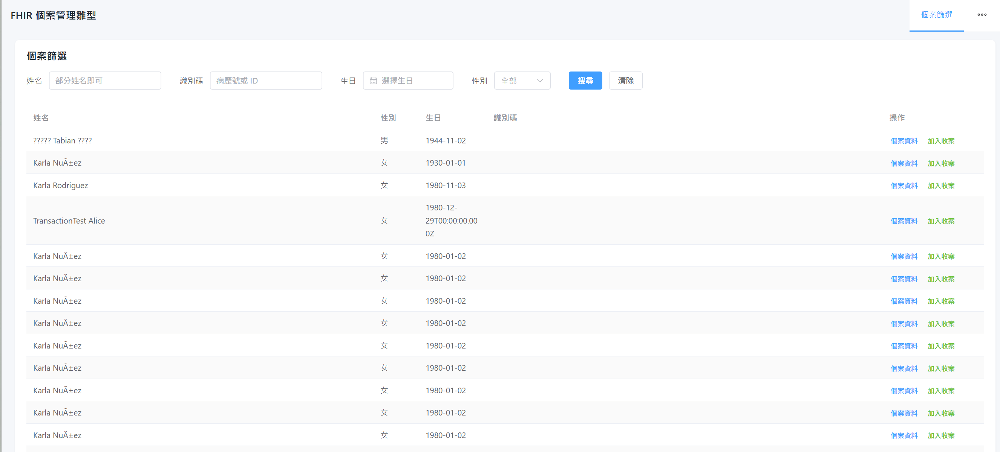
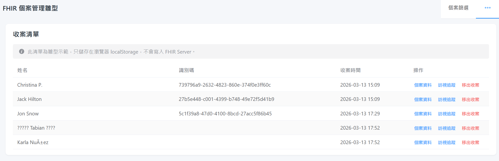
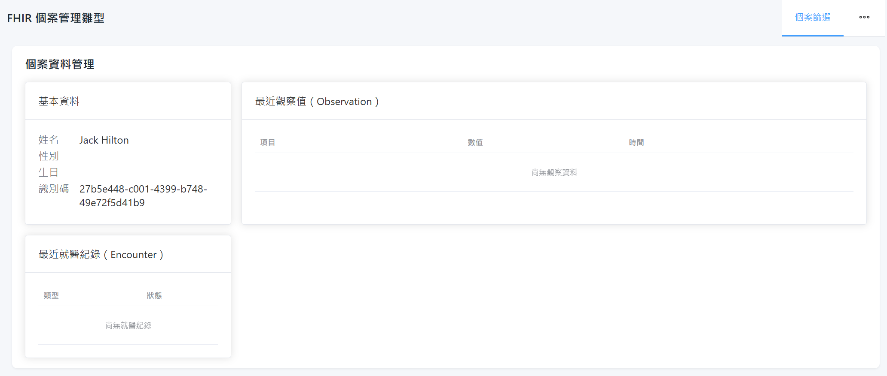
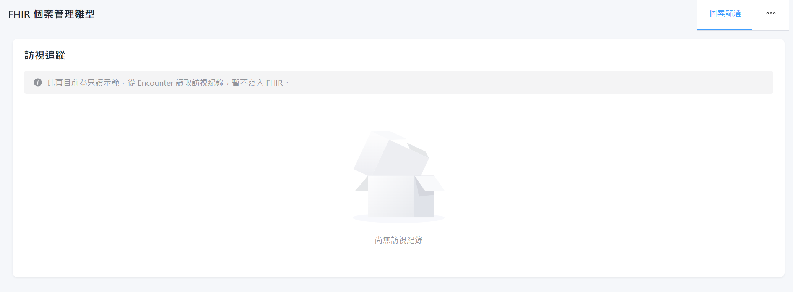

# FHIR 個案管理雛型（Vue 3 + Vite）

這是一個以 **FHIR Server** 為資料來源的「通用個案管理」雛型，示範如何從 FHIR 讀取病人與相關臨床資料，並提供：

- 個案篩選（Patient 搜尋）
- 收案清單（前端維護名單）
- 個案資料管理（Patient + Observation + Encounter 摘要）
- 訪視追蹤（以 Encounter 顯示簡易時間軸）

前端使用 **Vue 3 + TypeScript + Vite + Element Plus**，FHIR 目前連接公開的 **HAPI FHIR Server**，僅做 **讀取** 示範，未對公開伺服器寫入資料。

---

## 專案結構（重點）

- `index.html`：Vite 入口 HTML。
- `src/main.ts`：建立 Vue App，掛載 Router 與 Element Plus。
- `src/App.vue`：整體版型與上方導覽列（個案篩選 / 收案清單）。
- `src/router/index.ts`：路由設定
  - `/cases/search`：個案篩選頁
  - `/cases/intake`：收案清單頁
  - `/cases/:patientId/profile`：個案資料管理頁
  - `/cases/:patientId/visits`：訪視追蹤頁
- `src/api/fhirClient.ts`：呼叫 FHIR Server 的共用 client。
- `src/types/fhir.ts`：部分 FHIR 型別定義（Patient / Observation / Encounter / Bundle）。
- `src/composables/useCaseSearch.ts`：個案搜尋邏輯。
- `src/composables/useIntakeList.ts`：收案清單（localStorage）邏輯。
- `src/composables/useCaseDetail.ts`：個案資料（Patient + Observation + Encounter）查詢。
- `src/composables/useCaseVisits.ts`：訪視紀錄（Encounter）查詢。
- `src/views/CaseSearchView.vue`：個案篩選頁。
- `src/views/CaseIntakeListView.vue`：收案清單頁。
- `src/views/CaseProfileView.vue`：個案資料頁。
- `src/views/CaseVisitsView.vue`：訪視追蹤頁。

---

## 環境設定

專案使用 `.env` 設定 FHIR Server 位址：

```bash
VITE_FHIR_BASE_URL=https://hapi.fhir.org/baseR4
```

若要切換成院內 FHIR Server，只需修改 `.env` 中的 `VITE_FHIR_BASE_URL` 並重新啟動 dev server。

> 建議：正式環境請搭配 OAuth2 / OpenID Connect 等認證機制，本雛型僅示範無認證的 POC。

---

## 開發與啟動

在專案根目錄執行：

```bash
npm install
npm run dev
```

瀏覽器開啟 `http://localhost:5173`。

---

## 使用 Docker 部署（建議 demo / POC 用）

### Build image

在專案根目錄（含 `Dockerfile`）執行：

```bash
docker build -t fhir-case-management .
```

> 如需指定自訂 FHIR Server，可在 build 前修改 `.env` 中的 `VITE_FHIR_BASE_URL`，或改用建置流程將環境值帶入（本雛型先以檔案為主）。

### Run container

```bash
docker run --rm -p 8080:80 fhir-case-management
```

瀏覽器開啟 `http://localhost:8080` 即可看到相同的雛型畫面。

此 image 內容為：

- build 階段：使用 Node 建置 Vite 靜態檔案（輸出至 `dist/`）
- run 階段：使用 Nginx 伺服 `dist/`，並透過 `nginx.conf` 將 SPA 路由（例如 `/cases/...`）全部 fallback 到 `index.html`。

---

## Demo 操作流程（給簡報 / 示範用）

### 1. 個案篩選（/cases/search）

1. 點選上方導覽列的「**個案篩選**」。
2. 在搜尋條件輸入：
   - 姓名：可輸入部分姓名（英文或拼音）做模糊搜尋。
   - 識別碼：病歷號或 ID（依 HAPI 測試資料而定）。
   - 生日、性別：可選擇性使用。
3. 按下「**搜尋**」按鈕。
4. 下方表格會顯示來自 FHIR 的 `Patient` 清單：
   - 姓名、性別、生日、識別碼。
   - 操作欄包含：
     - 「**個案資料**」→ 進入該個案的資料管理頁。
     - 「**加入收案**」→ 將此個案加入收案清單（儲存在 localStorage）。

> 示意截圖建議：  
> - 檔名：`docs/case-search.png`  
> - 畫面：上方搜尋條件 + 下方 Patient 表格。

### 2. 收案清單（/cases/intake）

1. 由個案篩選頁按「加入收案」後，切換到「**收案清單**」頁。
2. 可看到目前收案的個案列表（資料存在瀏覽器 `localStorage`，非寫入 FHIR）：
   - 姓名、識別碼、收案時間。
3. 操作欄包含：
   - 「**個案資料**」→ `/cases/:id/profile`
   - 「**訪視追蹤**」→ `/cases/:id/visits`
   - 「**移出收案**」→ 從收案清單移除。

> 示意截圖建議：  
> - 檔名：`docs/intake-list.png`  
> - 畫面：收案清單表格與頂端提示（說明僅儲存在 localStorage）。

### 3. 個案資料管理（/cases/:patientId/profile）

1. 從「個案篩選」或「收案清單」點「**個案資料**」進入。
2. 畫面左側顯示個案基本資料（`Patient`）：
   - 姓名、性別、生日、識別碼。
3. 右側包含兩個表格：
   - **最近觀察值（Observation）**：
     - 項目名稱、數值（含單位）、時間。
   - **最近就醫紀錄（Encounter）**：
     - 類型、狀態、起訖時間。

> 示意截圖建議：  
> - 檔名：`docs/case-profile.png`  
> - 畫面：左側基本資料卡片 + 右側 Observation / Encounter 表格。

### 4. 訪視追蹤（/cases/:patientId/visits）

1. 從「收案清單」點「**訪視追蹤**」進入。
2. 系統會查詢該個案的 `Encounter`，以 **時間軸 (Timeline)** 呈現：
   - 每一筆訪視：顯示類型（type.text 或 class.code）、狀態、開始／結束時間。
3. 此頁目前為 **只讀示範**，不會對 FHIR 資料寫入或修改。

> 示意截圖建議：  
> - 檔名：`docs/visit-timeline.png`  
> - 畫面：右側縱向時間軸，顯示多筆訪視事件。

---

## 截圖檔放置建議

可在專案中新增 `docs/` 資料夾，將實際截圖放入，並在簡報或文件中引用：

```markdown




```

如僅在 README 展示，可以直接使用上述語法；若要嵌入簡報，可將 `docs/` 當作圖片來源目錄。

---

## 後續擴充方向（建議）

- **接院內 FHIR Server**：改用院內 endpoint，並加入認證機制（OAuth2 / JWT 等）。
- **真正的收案結構**：以 FHIR `CarePlan` 或 `EpisodeOfCare` 表示「收案」，而非 localStorage。
- **權限與角色**：加入登入（個管師、醫師、管理者）與權限控管。
- **報表與統計**：個案數、訪視完成率、依方案或診斷分類等統計圖表。

此雛型可作為醫院內部討論 FHIR 導入與個案管理流程設計的起點。若需要，我們可以再根據實際場域調整欄位與流程細節。
